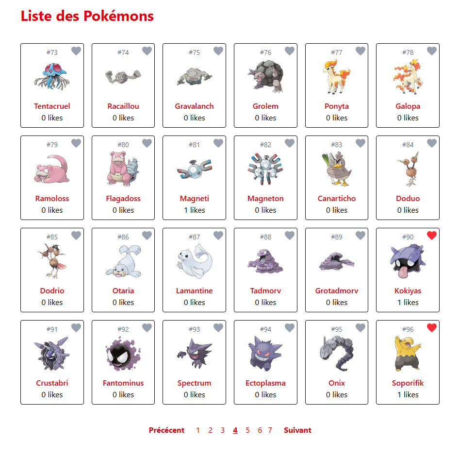
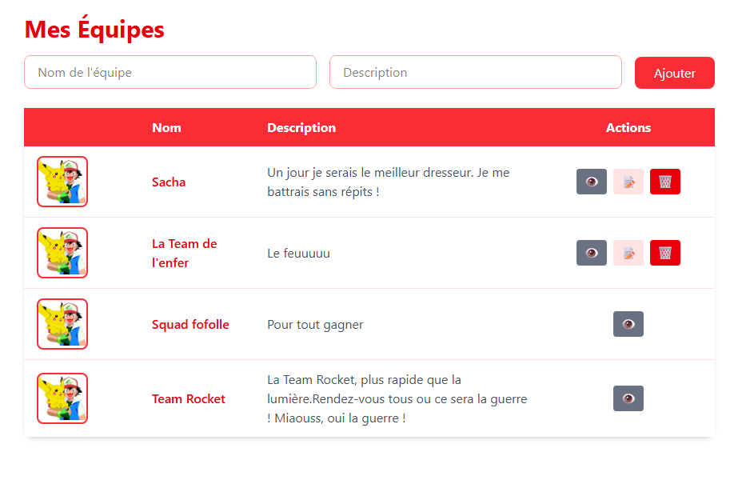
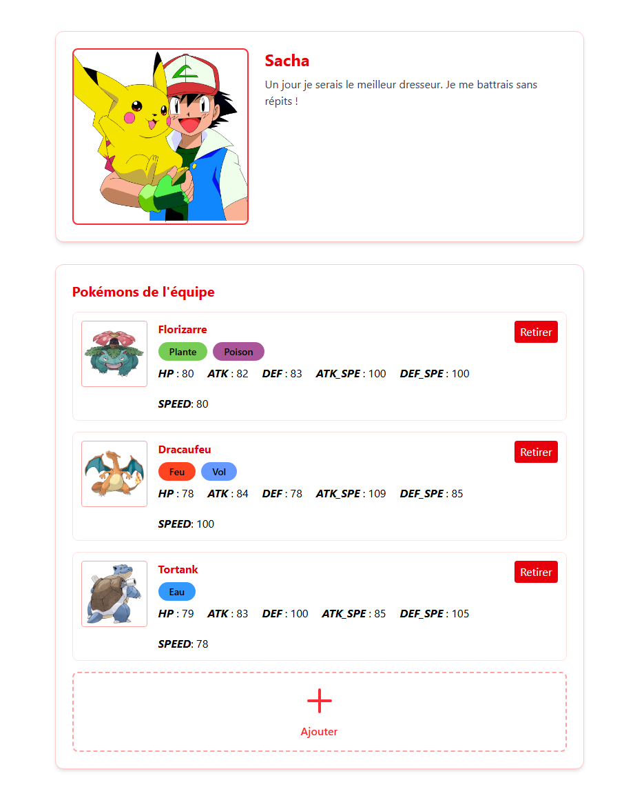
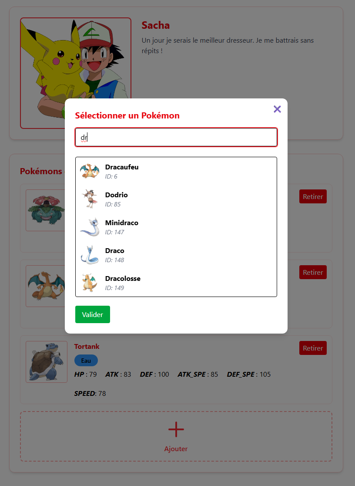

# POKÉDEX

## Présentation

The Pokédex is a backend focused project made to showcase my ability to build API and efficiently communicate with the front-end. This project was made in 5 days.    

The features include : Authentification, API calls to fetch, create, update and delete teams, adding pokemon to a team we own, pagination in pokemon list and search system with filters.  

## Démonstration

Voici une démonstration des fonctionnalités :

[Regarder la démo](https://www.youtube.com/watch?v=LwrnSHN2m8o)

## Aperçu

Liste des pokémons avec pagination :

---

Liste des équipes :

---

Liste des pokémons dans une équipe :

---

Filtre des pokémons :

---

